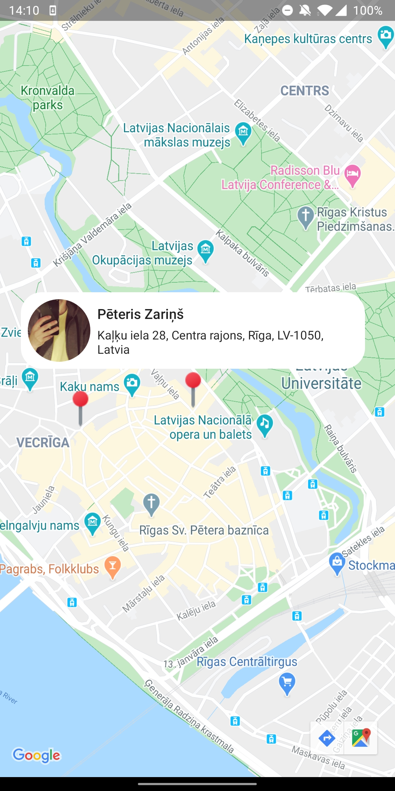

# mapful

An application, that connects to a server using TCP, displays user pins on map and updates in real-time

 

# Technologies used: 
- Kotlin
- Google Maps
- Koin – dependency injection
- Ktor as network library 
- Coil for image-loading 
- Android Architecture Components
